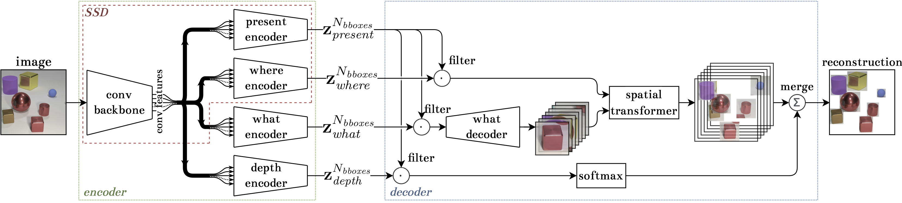

# SSDIR

Single Shot Multi-Box Detect Infer & Repeat implementation in PyTorch



## Development

Requirements:

- Install `poetry` (https://python-poetry.org/docs/#installation)
- Use `poetry` to handle requirements
  - Execute `poetry add <package_name>` to add new library
  - Execute `poetry install` to create virtualenv and install packages

## Training

To train the model use the `train.py` script. Activate the environment by running `poetry shell` and run `python train.py --help` to see all the available options. See [supplementary material](SUPPLEMENTARY.md) for details on hyperparameter settings in the research.

SSDIR re-uses trained [SSD](https://github.com/piotlinski/ssd) models and shares same datasets implementation. See the repository for more details.

## Manual

Use `make` to run commands

- `make help` - show help
- `make test` - run tests
  - `args="--lf" make test` - run pytest tests with different arguments
- `make shell` - run poetry shell

## Supplementary materials

In [supplementary materials](SUPPLEMENTARY.md) we shared more details about the model.

## Reference

If you use SSDIR in your research, please consider citing:

```
TBA
```

