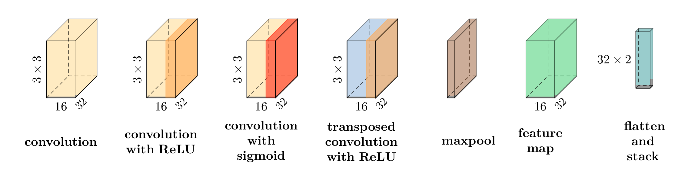
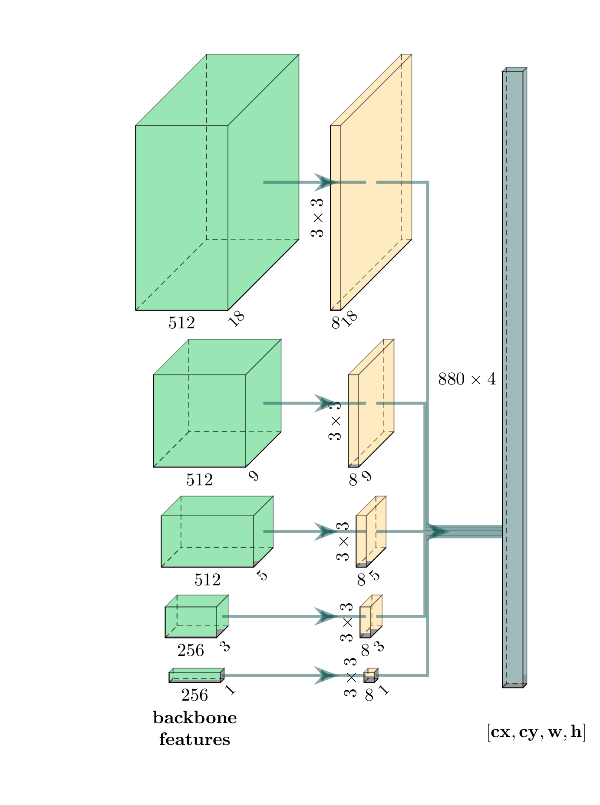
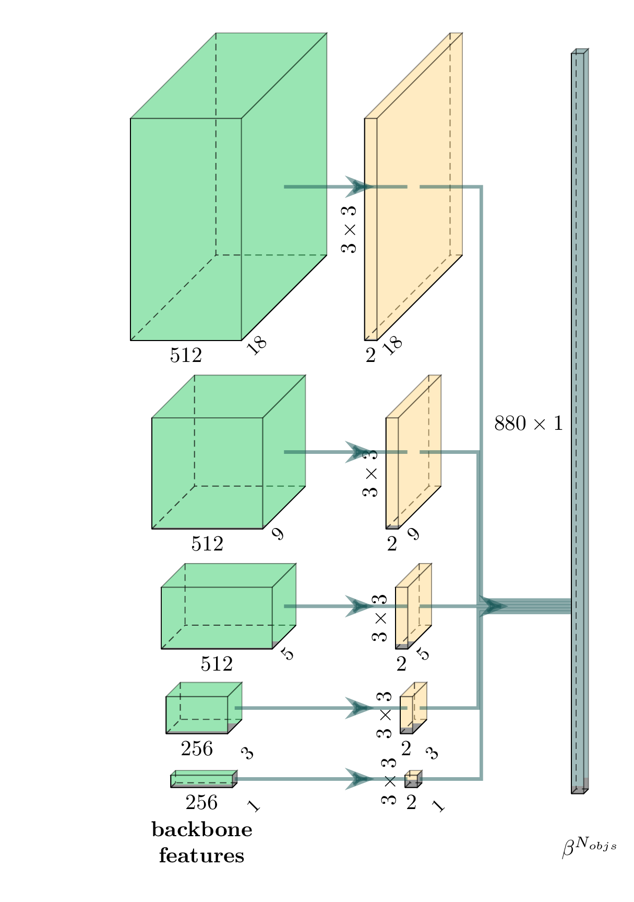
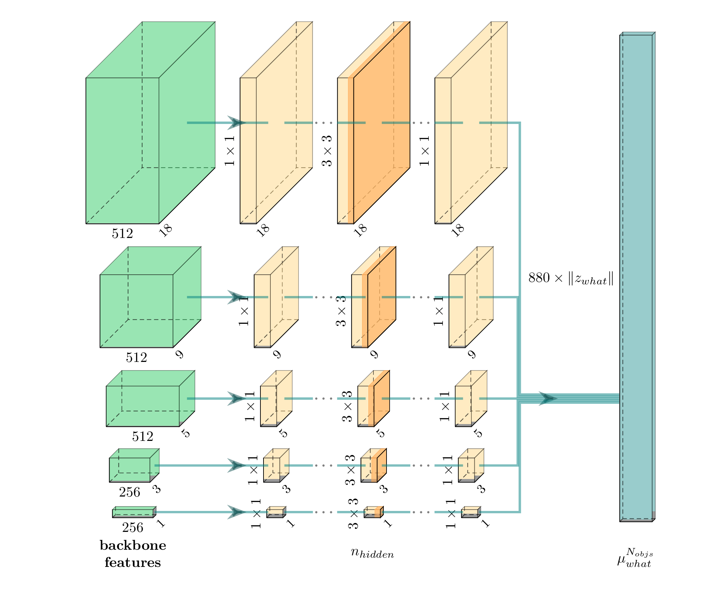
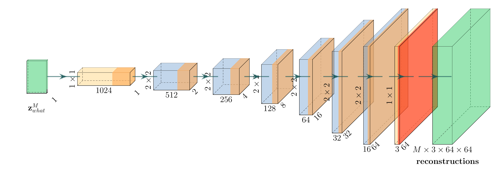
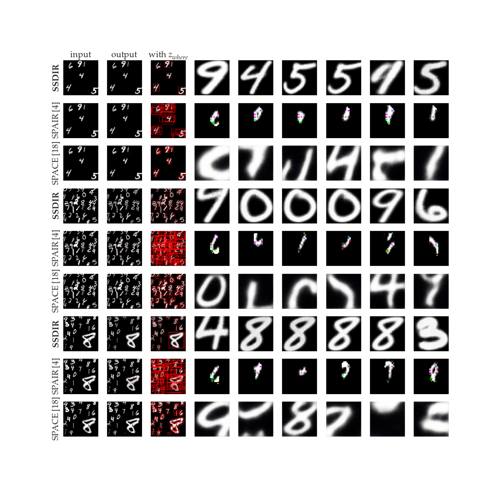
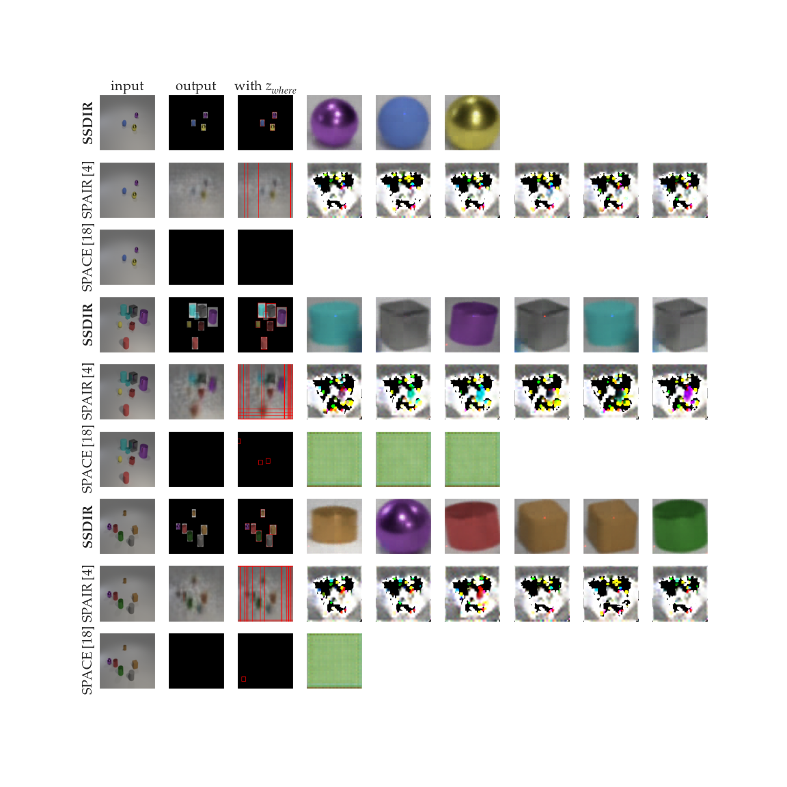
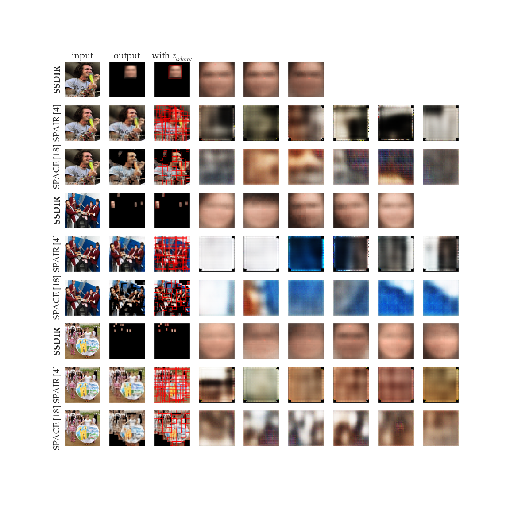

# Supplementary material

The architecture details of the encoder and decoder networks are
described below and shown in figures. Figure below shows
visualization legend, describing each type of layer used in the model
and additional annotations for determining their shapes. Note that we
use the same notations as in the paper.

- _convolution_ - convolution layer with   kernels without an activation function, outputting  feature maps,
- _convolution with ReLU_ - convolution layer with ReLU activation function and   kernels, outputting  feature maps,
- _convolution with sigmoid_ - convolution layer with sigmoid activation function and   kernels outputting  feature maps,
- _transposed convolution with ReLU_ - transposed convolution layer with ReLU activation function and   kernels, outputting  feature maps,
- _maxpool_ - MaxPool2D layer,
- _feature map_ - feature map tensor of shape ,
- _flatten and stack_ - tensor created by flattening and stacking vectors assigned to each cell in each feature map, of shape .

## Encoder network

Algorithm below presents SSDIR's encoder flow: for each cell in
feature pyramid's grids it creates _where_, _present_, _what_ and
_depth_ latent variables. The inference for each cell in the feature
pyramid, as well as generating latent representations, is conducted
parallelly.

| INPUT: normalized image  objects' latent representations   OUTPUT: (, , , )|
|:-|
| Backbone();|
| WhereEncoder();|
| PresentEncoder();|
| WhatEncoder();|
| DepthEncoder();|
|;|
|;|
|;|
|;|
|RETURN: , , , |

#### Convolutional backbone

The backbone used in SSDIR is a standard VGG11 with batch normalization,
whose classification head was replaced with a feature pyramid, as shown
in figure below. The input images are normalized with mean
 and standard deviation
 and resized to
. As a result, the backbone outputs  feature
maps of resolutions , , ,
 and , which denote the sizes of grids in each
level of the feature pyramid. These features are passed to latent
vectors' encoders. During training, weights of the backbone are frozen.

#### SSDIR _where_ and _present_ encoders

The architectures of _where_ and _present_ encoders are presented in
figures below. Both encoders are based on SSD
prediction heads and utilize one convolutional layer for each feature
map. Since the SSD model used in SSDIR assigns two predictions to each
cell, the output representation consists of  vectors. As in the
backbone's case, the weights of encoders transferred from an SSD model
are frozen during training SSDIR.

| _where_ encoder | _present_ encoder |
|-|-|
|  |  |

#### SSDIR _depth_ and _what_ encoder

The _what_ encoder, shown in figure below, is slightly extended as compared to other
encoders. Each feature map can be processed by multiple convolutional
layers, each with the same number of kernels, equal to the size of
 latent vector. The output is a vector of means,
used to sample the  latent vector.

The architecture of the _depth_ encoder is similar to the _present_
encoder (see figure below). As in the _what_ encoder, here the output
is used as mean for sampling  latent vector.
| _what_ encoder | _depth_ encoder |
|-|-|
|  |  |

These modules generate one latent vector for each cell; in order to
match the size of SSD's output, each latent vector is duplicated.

## Decoder network

Algorithm below shows the flow of the SSDIR decoder network.
First, all latent vectors are filtered according to
, producing  present-only latent vectors.
For batched decoding and transforming reconstructions, all filtered
latent representations in a batch are stacked and forwarded at once
through _what_ decoder and the spatial transformer. The output image,
created by merging transformed reconstructions, is normalized to
increase the intensities for visual fidelity.

| INPUT: objects' latent representations (, , , )  OUTPUT: reconstructed images |
|:-|
| Filter();
| Filter();|
| Filter();|
| WhatDecoder();|
| STN();|
| SoftMax();|
| WeightedMerge();|
|Normalize();|
|RETURN: |

#### SSDIR _what_ decoder

The _what_ decoder consists of a sequence of convolutional layers. The
first one, containing   kernels, prepares a larger
feature map for transposed convolution. Then, a series of transposed
convolutions with strides of size , each with -sized
filters upscale the feature map to achieve  resolution.
Finally, the last convolutional layer with the sigmoid activation
function outputs 3 channels, creating  objects' reconstructions.

#### Spatial Transformer and merging

The filtered  latent vectors are used to
transform decoded reconstructions to the inferred location on the image.
We use affine transformation to create   images,
which are merged according to softmaxed .

## Other details

Standard deviations, used to sample latent representations of each
object, are treated as model hyperparameters. They are given for each
experiment in Section Training.

To increase the stability of training, the latent vectors of non-present
objects (those, whose  probability is lower than ) can be
reset, in order to prevent their values from exploding, as noticed
during training when transferring a pre-trained backbone, _where_, and
_present_ encoders from SSD. In such a case, all non-present objects'
means were set to , all standard deviations were set to , and
all bounding box parameters were set to
.

We noticed that training only _what_ and _depth_ encoders was not
sufficient to learn high-quality representations for more complex
datasets. In such a case, it is possible to clone the convolutional
backbone for learning  and 
and train it jointly, while preserving the originally learned weights
for inferring  and .

The weights of modules, which are not transferred from a trained SSD
model, are initialized using Xavier, with biases set to .

# Datasets

#### [Multi-scale scattered MNIST](https://github.com/piotlinski/multiscalemnist)

We prepared the Multi-scale scattered MNIST dataset to test multi-object
representation learning using images with highly varying object sizes.
It can be treated as a benchmark dataset, and its construction procedure
contributes to this submission. The dataset was generated according to
algorithm below, with a given set of parameters:
 - - output image size,
 -  - set of grid sizes used for placing digits,
 -  - minimum size of a digit in the image,
 -  - maximum size of a digit in the image,
 -  - the range in which the position of a digit may vary, given as the percentage of the cell size,
 -  - threshold for indicating if a cell in a grid is already filled, given as the percentage of the cell's area,
 -  - number of images to generate.

|INPUTS:  dataset,  , , , , , ,   OUTPUTS: a generated dataset|
|:-|
|2   CreateEmptyImage();|
|;|
|;|
| DrawGridSize();|
|;|
| randint(min=, max=);|
|;|
| DrawGridCell(, ); |
| RandomDigitSize(, , );|
| GetDigit(); |
| Resize(, );|
| CalculateBboxCoords(, , );|
| AddDigitToImage(, , ); |
| append();|
| append();|
| MarkFilled(, );|
| append(, , );|
|RETURN: |

In table below we gathered the parameter values used for
generating _main_ dataset, prepared for training the SSD and SSDIR
models. An additional validation dataset the size of 10% of the
training dataset was used for evaluating SSDIR, SPAIR, and SPACE with
regard to per-object reconstructions and the downstream task. We also
present all researched values of parameters, combinations of which were
used to generate the ablation study's datasets.

|parameter | _main_ | ablation |
| :------- | :----: | :------: |
|  |  | |
| |  | ,   ,   ,   ,    |
| |  | |
| |  | |
| |  |  |
| |  |  |
| |  |  |

#### CLEVR

We used the dataset generated originally by the authors. It contains
object of  pre-defined sizes (large and small),  colors, 
materials and  shapes. The locations of the objects in the scene were
processed to generate bounding boxes for training the SSD model. We
trained SSDIR, SPAIR, and SPACE using the entire training dataset, while
the validation dataset was used for evaluating each model's
reconstructions quality.

#### WIDER FACE

This dataset was used for evaluating the performance of the models in
images with a complex background when trying to focus on a particular
type of object (here: faces). The dataset contains bounding box
coordinates and hence could be used for training the SSD model directly.
We applied an additional preprocessing stage, dropping small bounding
boxes (smaller than 4% of the image) and removing images without any
bounding box. Then, the SSDIR, SPAIR, and SPACE models were trained with
the training dataset, and the validation dataset served as the
reconstructions quality benchmark.

# Training regime and hyperparameters

In this section, we summarize the hyperparameters of SSDIR used for
training models for each dataset. The batch size was tuned to fit the
GPU's memory size, whereas the other hyperparameters' optimization was
conducted using Bayesian model-based optimization. In table below
we present the hyperparameters used for each task and dataset (the
denominations of the hyperparameters match those used in the paper).

| symbol | description | MNIST | CLEVR | WIDER |
| :----- | :---------- | :---: | :---: | :---: |
| | batch size |  |  |  |
| | learning rate |  |  |  |
| | clone backbone | false | true | true |
|  | image reconstruction error coefficient |  |  |  |
|  | per-object reconstruction error coefficient |  |  |  |
|  |  KL loss coefficient |  |  |  |
|  |  KL loss coefficient |  |  |  |
|  |  standard deviation |  |  |  |
|  |  standard deviation |  |  |  |
|  | number of hidden layers in *what* encoder |  |  |  |
|  |  latent vector size |  |  |  |
| |  prior |  |  |  |
| |  prior |  |  |  |

## Additional reconstructions

Below, we provide additional reconstructions for the following datasets: scattered MNIST, CLEVR and WIDER FACE.
Once again, the number of reconstructions shown for each image is limited, due to the total number of objects reconstructed by each model; if the number of objects reconstructed by a model was smaller than the number of columns, we show only the ones returned by the model.

### Multi-scale MNIST

### CLEVR

### WIDER FACE

